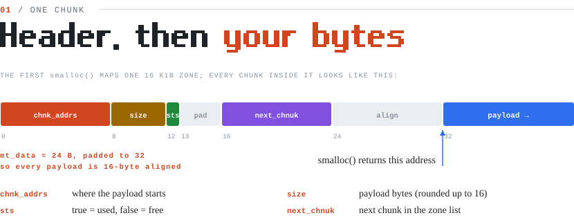
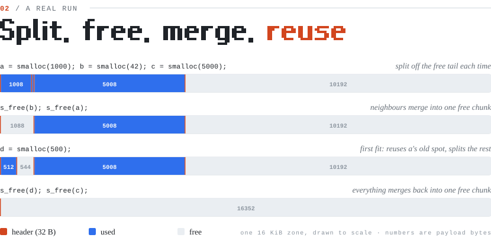

<picture>
  <source media="(prefers-color-scheme: dark)" srcset="docs/banner-dark.svg" />
  
</picture>

this repo explores the inner workings of memory allocation by implementing a small version of the malloc function in C. in this project i'm aiming to get a deep understanding of how the operating system manages memory and the concepts behind dynamic memory allocation.

<picture>
  <source media="(prefers-color-scheme: dark)" srcset="docs/layout-dark.svg" />
  
</picture>

<picture>
  <source media="(prefers-color-scheme: dark)" srcset="docs/roadmap-dark.svg" />
  
</picture>

**How it works**

- `smalloc(size)` rounds `size` up to 16, then walks the chunk list (`g_chunk` → `next_chnuk` → …) for the first free chunk that is big enough. If none fits, it `mmap`s a new zone (16 KiB, or bigger for large requests) and appends it.
- If the chosen chunk is much bigger than needed, it is **split**: the tail becomes a new free chunk right after it.
- `s_free(ptr)` finds the chunk, sets `sts = false`, and **merges** it with free neighbours that sit right next to it in memory, so space doesn't break into tiny pieces.
- `show_mem()` prints every chunk with its address, size and state.

## Run it

```bash
make
./smalloc        # runs main.c: allocate, free, reuse, and print the chunk list
```

<sub>Diagrams in <code>docs/</code> are generated SVGs, drawn to match the code in this repo.</sub>
